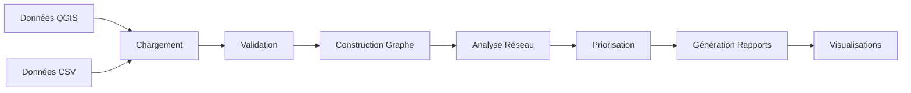
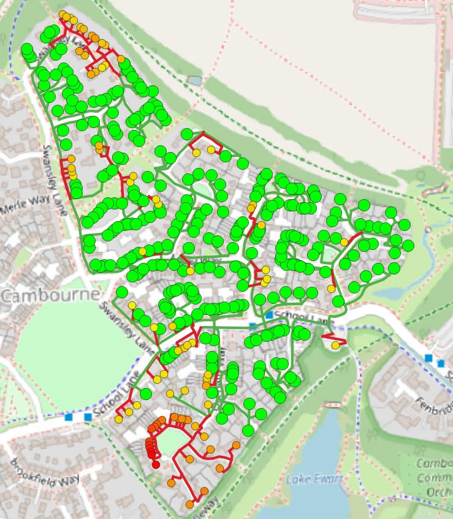
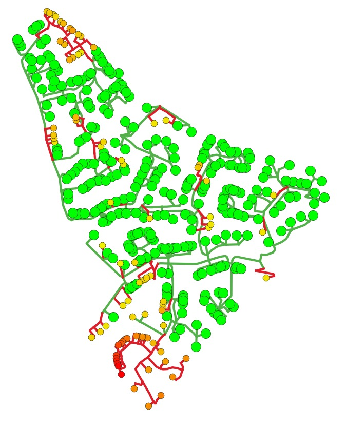
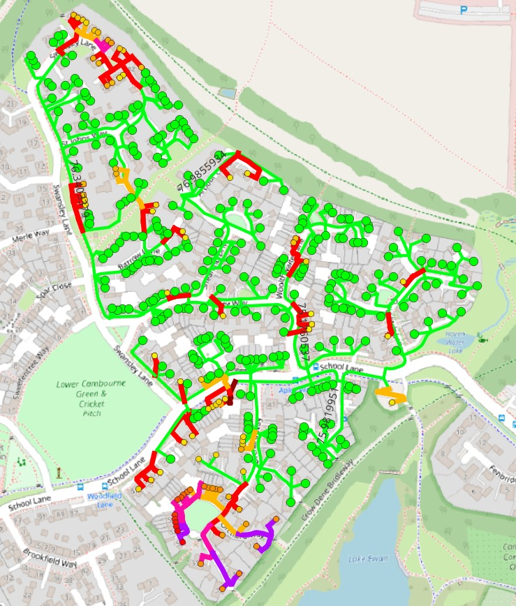
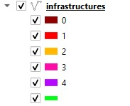
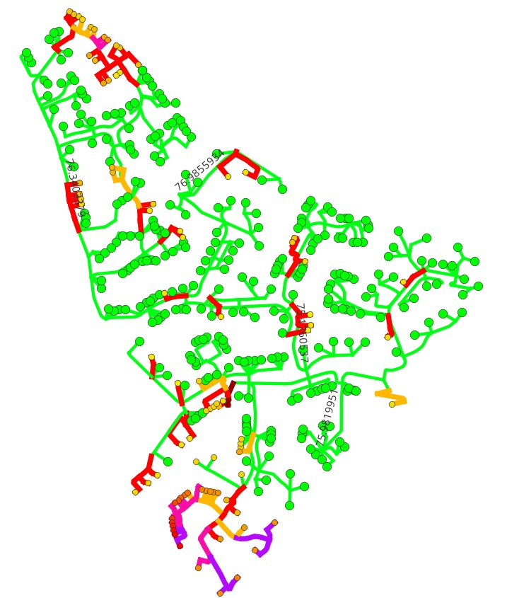

# ⚡ Lightning Reconnection

**Planification optimisée du rétablissement du raccordement électrique après intempéries**

Système d'aide à la décision pour prioriser et planifier les interventions de raccordement électrique dans une petite ville, en maximisant l'impact social tout en maîtrisant les coûts et les contraintes opérationnelles.

[](LICENSE)
[](https://www.python.org/downloads/)

## 📋 Table des matières

- [Aperçu](#-aperçu)
- [Fonctionnalités](#-fonctionnalités)
- [Installation](#-installation)
- [Utilisation](#-utilisation)
- [Architecture](#-architecture)
- [Méthodologie](#-méthodologie)
- [Données d'entrée](#-données-dentrée)
- [Résultats](#-résultats)
- [Développement](#-développement)
- [Contributeurs](#-contributeurs)
- [Licence](#-licence)

## 🎯 Aperçu

Lightning Reconnection est un outil d'analyse et de planification qui aide les gestionnaires de réseau électrique à :

- **Prioriser** les bâtiments à reconnecter selon des critères multiples
- **Optimiser** les coûts et délais d'intervention
- **Maximiser** l'impact social (nombre d'habitants reconnectés)
- **Visualiser** le réseau et les zones critiques

### Cas d'usage

- Planification post-intempéries (tempêtes, inondations)
- Maintenance programmée du réseau
- Extension du réseau électrique
- Simulation de scénarios de crise

## ✨ Fonctionnalités

### Analyse de réseau
- ✅ Modélisation du réseau électrique en graphe
- ✅ Détection des composantes connectées
- ✅ Identification des nœuds critiques (centralité)
- ✅ Calcul de métriques réseau (longueurs, capacités)

### Priorisation multi-critères
- ✅ **Score coût** : Optimisation budgétaire
- ✅ **Score urgence** : Type de bâtiment (hôpital > école > résidentiel)
- ✅ **Score distance** : Proximité des points de raccordement

### Visualisation
- ✅ Graphiques interactifs (coûts, distances)
- ✅ Export réseau en format GEXF (Gephi)
- ✅ Rapports JSON détaillés
- ✅ Tableaux CSV pour analyse Excel
- ✅ Ficher Shapfile pour analyse QGIS

### Reporting
- ✅ Rapport de priorisation avec métriques
- ✅ Analyse statistique complète
- ✅ Recommandations d'intervention
- ✅ Suivi des coûts cumulés

### Documentation
- Documentation Technique ([docs/documentation_technique.md](docs/documentation_technique.md))
- Documentation Racordement ([docs/documentation_racordement.md](docs/documentation_racordement.md))

## 🚀 Installation

### Prérequis

- Python 3.8 ou supérieur
- pip (gestionnaire de paquets Python)

### Installation rapide

```bash
# Cloner le dépôt
git clone https://github.com/morningstar-47/lightning_reconnection.git
cd lightning_reconnection

# Créer un environnement virtuel (recommandé)
python -m venv venv
source venv/bin/activate  # Linux/Mac
# ou
venv\Scripts\activate  # Windows

# Installer les dépendances
pip install -r requirements.txt
```

### Dépendances principales

```
geopandas>=0.14.0
networkx>=3.0
pandas>=2.0.0
matplotlib>=3.7.0
seaborn>=0.12.0
shapely>=2.0.0
```

## 📖 Utilisation

### Exécution basique

```bash
python main.py
```

###  Flux de données



### Workflow complet

```python
from analyze_network import NetworkAnalyzer

# 1. Initialiser l'analyseur
analyzer = NetworkAnalyzer(
    buildings_geojson='data/buildings.geojson',
    network_geojson='data/network.geojson',
    buildings_csv='data/buildings.csv',
    costs_csv='data/costs.csv'
)

# 2. Charger et analyser les données
analyzer.load_data()
buildings_gdf, network_gdf, buildings_df, costs_df = analyzer.analyze_data()

# 3. Construire le graphe réseau
G = analyzer.build_network_graph(buildings_gdf, network_gdf)

# 4. Calculer les priorités
prioritized_buildings = analyzer.calculate_prioritization(
    buildings_df, 
    costs_df
)

# 5. Générer les rapports
analyzer.generate_outputs(
    buildings_gdf, 
    network_gdf, 
    buildings_df, 
    costs_df, 
    G, 
    prioritized_buildings
)
```

### Options de configuration

#### Tarifs et durées (dans `infra.py`)

```python
PRIX_PAR_M = {
    'aérien': 500,
    'semi-aérien': 750,
    'fourreau': 900
}

DUREE_PAR_M = {
    'aérien': 2,      # heures-homme par mètre
    'semi-aérien': 4,
    'fourreau': 5
}

WORKER_PAY_PER_8H = 300  # €/jour
MAX_WORKERS_PER_INFRA = 4
```

#### Budget (dans `plan_raccordement.py`)
```python
BUDGET_TOTAL = 500000  # Budget total disponible (Estimation)
PHASE_BUDGETS = [0.40, 0.20, 0.20, 0.20]  # Répartition phases 1-4
generator_autonomy_h = 20  # Autonomie générateur (heures)
safety_margin = 0.8  # Marge de sécurité (80%)
```

#### Priorités métiers
```python
PRIORITES = {
    'hôpital': 1,
    'école': 2,
    'habitation': 3
}
```

## 🏗️ Architecture

```
lightning-reconnection/
├── data/                          # Données d'entrée
│   ├── buildings.geojson         # Géométries des bâtiments
│   ├── network.geojson           # Géométries du réseau
│   ├── buildings.csv/xlsx             # Attributs des bâtiments
│   └── costs.csv/xlsx                 # Coûts de raccordement
├── output/                        # Résultats générés
│   ├── analysis_report.json      # Rapport d'analyse complet
│   ├── prioritization_report.json # Rapport de priorisation
│   ├── prioritized_buildings.csv # Liste priorisée
│   ├── network_graph.gexf        # Graphe pour Gephi
│   └── visualizations/           # Graphiques PNG
├── src/                          # Code source
│   ├── analyze_network.py        # Module principal
│   ├── graph_builder.py          # Construction du graphe
│   ├── prioritization.py         # Algorithme de priorisation
│   └── visualization.py          # Génération de graphiques
├── tests/                        # Tests unitaires
├── docs/                         # Documentation détaillée
├── main.py                       # Point d'entrée
├── requirements.txt              # Dépendances Python
├── config.yaml                   # Configuration (optionnel)
├── README.md                     # Ce fichier
└── LICENSE                       # Licence MIT
```

## 📊 Méthodologie


### Analyse de graphe

- **Centralité de proximité** : Identifie les nœuds clés du réseau
- **Composantes connexes** : Détecte les zones isolées
- **Chemins critiques** : Calcule les itinéraires optimaux

### Visualisations du réseau









## 📥 Données d'entrée

### Format attendu

#### 1. `buildings.shp`
```json

```

#### 2. `network.shp`
```json

```

#### 3. `reseau_en_arbre.xlsx`
```xlsx
id_batiment	nb_maisons	infra_id	infra_type	longueur
E000001	4	P007111	infra_intacte	12.3144613356693
E000001	4	P007983	infra_intacte	40.3209288665353
E000001	4	P000308	infra_intacte	39.1407985664577

```

#### 4. `costs.csv`
```csv
building_id,cost,distance
1,162.47,1.25
2,256.94,3.14
3,523.82,8.48
```

### Checklist qualité des données

- [ ] Tous les `building_id` sont uniques
- [ ] Pas de valeurs manquantes dans les colonnes critiques
- [ ] Les coordonnées géographiques sont valides
- [ ] Les types de bâtiments correspondent à la nomenclature
- [ ] Les coûts et distances sont cohérents (> 0)
- [ ] Le système de coordonnées (CRS) est spécifié

## 📈 Résultats


**Fichier** : `BOMBOCLAAAT.csv` (configurable)

### Colonnes du plan

| Colonne | Description |
|---------|-------------|
| `phase` | Numéro de phase (0 = hôpital, 1-4 = phases budgétaires) |
| `id_batiment` | Premier bâtiment du groupe (compatibilité) |
| `id_batiments` | Liste de tous les bâtiments de la phase |
| `nb_batiments` | Nombre de bâtiments traités |
| `nb_infras_reparees` | Nombre d'infrastructures à réparer |
| `cout_total` | Coût matériel total (€) |
| `duree_totale_heures_homme` | Heures-homme nécessaires |
| `duree_min_elapsed_h` | Durée réelle minimale (avec max d'ouvriers) |
| `worker_cost_euros` | Coût salarial total (€) |
| `liste_infras_reparees` | Liste des IDs d'infrastructures |
| `warning` | Messages d'alerte (contraintes critiques) |

### Exemple de ligne
```csv
0,E000085,['E000085'],1,3,18483.26,77.92,9.35,2921.87,"['P005500','P007447','P007990']",""
```

**Interprétation** :
- Phase 0 (hôpital prioritaire)
- Coût matériel : 18 483 €
- 77,92 heures-homme nécessaires
- Réalisable en 9,35 heures avec 4 ouvriers par infra
- Coût salarial : 2 922 €

### Fichiers générés

| Fichier | Description | Format |
|---------|-------------|--------|
| `analysis_report.json` | Statistiques complètes du réseau | JSON |
| `prioritization_report.json` | Top 10 bâtiments prioritaires + stats | JSON |
| `prioritized_buildings.csv` | Liste complète triée par priorité | CSV |
| `network_graph.gexf` | Graphe pour visualisation Gephi | GEXF |
| `summary.txt` | Résumé textuel | TXT |

### Visualisations

Le dossier `output/visualizations/` contient :

- `population_distribution.png` : Répartition des habitants
- `cost_analysis.png` : Analyse des coûts
- `priority_distribution.png` : Distribution des priorités
- `distance_cost_scatter.png` : Corrélation distance/coût
- `cumulative_metrics.png` : Courbes cumulées

### Interprétation des résultats

#### Score composite élevé (> 0.7)
→ **Priorité maximale** : Intervention immédiate recommandée

#### Score composite moyen (0.4 - 0.7)
→ **Priorité secondaire** : Planifier à court terme

#### Score composite faible (< 0.4)
→ **Priorité basse** : Planifier à moyen/long terme

## 🛠️ Développement

### Exécuter les tests

```bash
# Tests unitaires
pytest tests/

# Avec couverture
pytest --cov=src tests/

# Tests spécifiques
pytest tests/test_prioritization.py -v
```

### Structure du code

```python
# Exemple d'extension - Nouveau critère de priorisation

def calculate_accessibility_score(building, road_network):
    """
    Ajoute un score d'accessibilité basé sur le réseau routier.
    
    Args:
        building: GeoDataFrame du bâtiment
        road_network: GeoDataFrame du réseau routier
        
    Returns:
        float: Score entre 0 et 1
    """
    nearest_road = road_network.distance(building.geometry).min()
    return 1 - (nearest_road / road_network.distance(building.geometry).max())

# Intégrer dans le calcul composite
composite_score = (
    0.25 × population_score +
    0.20 × cost_score +
    0.25 × urgency_score +
    0.15 × distance_score +
    0.15 × accessibility_score  # Nouveau critère
)
```

### Contribuer

1. Fork le projet
2. Créer une branche feature (`git checkout -b feature/AmazingFeature`)
3. Commit les changements (`git commit -m 'Add AmazingFeature'`)
4. Push vers la branche (`git push origin feature/AmazingFeature`)
5. Ouvrir une Pull Request

### Standards de code

- **Style** : PEP 8
- **Docstrings** : Google Style
- **Type hints** : Obligatoire pour les fonctions publiques
- **Tests** : Couverture minimale 80%

## 👥 Contributeurs

| Nom | Rôle | Contact |
|-----|------|---------|
| **OUAZAR Djamel** | Data Scientist | [GitHub](https://github.com/legb78) |
| **Mopeno-Bia Emmanuel** | Data Scientist | [GitHub](https://github.com/morningstar-47) |
| **HAMOUMA Amine** | Data Engenier | [GitHub](https://github.com/HamoumaAmine) |
| **ELMORTADA Hamza** | QGIS Specialist | [GitHub](https://github.com/weldhammadi) |

## 📄 Licence

Ce projet est sous licence MIT - voir le fichier [LICENSE](LICENSE) pour plus de détails.

## 📞 Support

- **Issues** : [GitHub Issues](https://github.com/morningstar-47/lightning_reconnection.git/issues)
- **Email** : les-tigres-md5-2025@hetic.eu
- **Documentation** : [Wiki](https://github.com/morningstar-47/lightning_reconnection.git/wiki)

## 🗺️ Roadmap

### Version 1.1 (Q2 2025)
- [ ] Interface web interactive (Streamlit/Dash)
- [ ] Export des plannings au format Gantt
- [ ] Intégration API météo pour prévisions
- [ ] Calcul automatique des durées d'intervention

### Version 2.0 (Q4 2025)
- [ ] Optimisation multi-objectifs (Pareto)
- [ ] Simulation Monte Carlo pour analyse de risque
- [ ] Module de routage pour équipes terrain
- [ ] Dashboard temps réel

## 🙏 Remerciements

- [NetworkX](https://networkx.org/) pour la modélisation de graphes
- [GeoPandas](https://geopandas.org/) pour l'analyse spatiale
- [Matplotlib](https://matplotlib.org/) & [Seaborn](https://seaborn.pydata.org/) pour les visualisations
- La communauté open-source Python

---

**⚡ Lightning Reconnection** - *Restoring power, connecting communities*