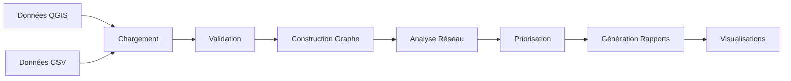

# 📚 Documentation Technique - Lightning Reconnection

## Table des matières

1. [Architecture système](#1-architecture-système)
2. [Modules détaillés](#2-modules-détaillés)
3. [API Reference](#3-api-reference)
4. [Algorithmes](#4-algorithmes)
5. [Structures de données](#5-structures-de-données)
6. [Performance](#6-performance)
7. [Sécurité](#7-sécurité)
8. [Déploiement](#8-déploiement)

---

## 1. Architecture système

### 1.1 Vue d'ensemble

```
┌────────────────────────────────────────────────────────────────────┐
│                     LIGHTNING RECONNECTION                         │
├────────────────────────────────────────────────────────────────────┤
│                                                                    │
│  ┌──────────────┐       ┌──────────────┐      ┌───────────┐        │
│  │   Data Layer │─────▶│  Core Engine │─────▶│  Outputs  │        │
│  └──────────────┘       └──────────────┘      └───────────┘        │
│         │                      │                     │             │
│    [GeoJSON/CSV]           [Analysis]             [Reports]        │
│         │                      │                     │             │
│         ├─ batiment.shp        ├─ Graph Builder      ├─ JSON       │
│         ├─ infra.shp           ├─ Prioritization     ├─ CSV        │
│         ├─ reseau_en_arnre.csv ├─ Metrics Calc       ├─ GEXF       │
│         └─ costs.csv           └─ Visualization      └─ PNG        │
│                                                                    │
└────────────────────────────────────────────────────────────────────┘
```

### 1.2 Flux de données



### 1.3 Composants principaux

| Composant | Responsabilité | Technologies |
|-----------|----------------|--------------|
| **DataLoader** | Chargement et validation | GeoPandas, Pandas |
| **GraphBuilder** | Construction du graphe réseau | NetworkX, Shapely |
| **NetworkAnalyzer** | Analyse topologique | NetworkX |
| **Prioritizer** | Calcul scores multi-critères | NumPy, Pandas |
| **Reporter** | Génération outputs | JSON, CSV, Matplotlib |

---

## 2. Modules détaillés

### 2.1 `analyze_network.py`

**Module principal orchestrant l'analyse complète.**

#### Classes

##### `NetworkAnalyzer`

```python
class NetworkAnalyzer:
    """
    Gestionnaire principal de l'analyse du réseau électrique.
    
    Attributes:
        buildings_geojson (str): Chemin vers le fichier GeoJSON des bâtiments
        network_geojson (str): Chemin vers le fichier GeoJSON du réseau
        buildings_csv (str): Chemin vers le CSV des attributs bâtiments
        costs_csv (str): Chemin vers le CSV des coûts
        output_dir (str): Répertoire de sortie des résultats
    """
    
    def __init__(self, buildings_geojson, network_geojson, 
                 buildings_csv, costs_csv, output_dir='output'):
        """Initialise l'analyseur avec les chemins de fichiers."""
        
    def load_data(self) -> bool:
        """
        Charge toutes les données d'entrée.
        
        Returns:
            bool: True si chargement réussi, False sinon
            
        Raises:
            FileNotFoundError: Si un fichier est manquant
            ValueError: Si les données sont invalides
        """
        
    def validate_data(self) -> Dict[str, List[str]]:
        """
        Valide l'intégrité des données chargées.
        
        Returns:
            Dict contenant les erreurs par catégorie
            
        Example:
            >>> errors = analyzer.validate_data()
            >>> if errors['critical']:
            ...     print("Erreurs critiques détectées!")
        """
        
    def analyze_data(self) -> Tuple[gpd.GeoDataFrame, ...]:
        """
        Effectue l'analyse statistique des données.
        
        Returns:
            Tuple: (buildings_gdf, network_gdf, buildings_df, costs_df)
        """
        
    def build_network_graph(self, buildings_gdf, network_gdf) -> nx.Graph:
        """
        Construit le graphe du réseau électrique.
        
        Args:
            buildings_gdf: GeoDataFrame des bâtiments
            network_gdf: GeoDataFrame du réseau
            
        Returns:
            nx.Graph: Graphe NetworkX avec attributs
            
        Notes:
            - Nœuds : substations + buildings + network points
            - Arêtes : segments réseau + connexions bâtiments
        """
```

#### Méthodes de calcul

```python
def calculate_prioritization(self, buildings_df, costs_df, 
                            weights=None) -> pd.DataFrame:
    """
    Calcule les scores de priorisation multi-critères.
    
    Args:
        buildings_df: DataFrame des bâtiments
        costs_df: DataFrame des coûts
        weights: Dict des poids par critère (optionnel)
            {
                'population': 0.30,
                'cost': 0.25,
                'urgency': 0.25,
                'distance': 0.20
            }
            
    Returns:
        DataFrame avec colonnes:
            - building_id
            - population_score
            - cost_score
            - urgency_score
            - distance_score
            - composite_score
            - priority_rank
            - cumulative_*
            
    Algorithm:
        1. Normalisation des métriques [0, 1]
        2. Application des poids
        3. Calcul score composite
        4. Tri décroissant
        5. Calcul métriques cumulées
    """
```

### 2.2 `graph_builder.py`

**Module de construction et manipulation de graphes.**

#### Fonctions principales

```python
def create_network_graph(network_gdf: gpd.GeoDataFrame, 
                        buildings_gdf: gpd.GeoDataFrame,
                        substations: List[Dict]) -> nx.Graph:
    """
    Crée un graphe NetworkX à partir des données géospatiales.
    
    Args:
        network_gdf: Segments du réseau (LineString)
        buildings_gdf: Points des bâtiments (Point)
        substations: Liste des postes électriques
        
    Returns:
        nx.Graph: Graphe non-orienté avec attributs
        
    Node attributes:
        - 'type': 'network' | 'building' | 'substation'
        - 'x', 'y': Coordonnées
        - 'building_id': ID du bâtiment (si applicable)
        - 'capacity': Capacité (si substation)
        
    Edge attributes:
        - 'length': Longueur du segment (m)
        - 'segment_id': ID du segment
        - 'status': 'active' | 'damaged'
        - 'capacity': Capacité (kW)
        
    Example:
        >>> G = create_network_graph(network, buildings, substations)
        >>> print(f"Nodes: {G.number_of_nodes()}")
        >>> print(f"Edges: {G.number_of_edges()}")
    """
    
def add_building_connections(G: nx.Graph, 
                            buildings_gdf: gpd.GeoDataFrame,
                            max_distance: float = 50.0) -> nx.Graph:
    """
    Connecte les bâtiments aux points réseau les plus proches.
    
    Args:
        G: Graphe du réseau existant
        buildings_gdf: GeoDataFrame des bâtiments
        max_distance: Distance max de connexion (mètres)
        
    Returns:
        nx.Graph: Graphe avec bâtiments connectés
        
    Algorithm:
        1. Pour chaque bâtiment:
            a. Trouver le nœud réseau le plus proche
            b. Si distance < max_distance:
                - Créer arête de connexion
                - Calculer coût/distance
                
    Notes:
        - Utilise l'index spatial (R-tree) pour performance
        - Les connexions ont un attribut 'type': 'connection'
    """
    
def calculate_centrality(G: nx.Graph, 
                        metric: str = 'closeness') -> Dict[str, float]:
    """
    Calcule la centralité des nœuds du réseau.
    
    Args:
        G: Graphe NetworkX
        metric: Type de centralité
            - 'closeness': Centralité de proximité
            - 'betweenness': Centralité d'intermédiarité
            - 'degree': Centralité de degré
            - 'eigenvector': Centralité de vecteur propre
            
    Returns:
        Dict: {node_id: centrality_score}
        
    Interpretation:
        - Score élevé → Nœud stratégique/critique
        - Utile pour identifier points de défaillance
        
    Example:
        >>> centrality = calculate_centrality(G, 'closeness')
        >>> critical_nodes = sorted(centrality.items(), 
        ...                         key=lambda x: x[1], 
        ...                         reverse=True)[:10]
    """
```

### 2.3 `prioritization.py`

**Module d'algorithmes de priorisation.**

#### Classes de scoring

```python
class ScoreCalculator:
    """Calculateur de scores multi-critères."""
    
    @staticmethod
    def population_score(inhabitants: pd.Series) -> pd.Series:
        """
        Normalise le nombre d'habitants [0, 1].
        
        Formula:
            score = inhabitants / max(inhabitants)
            
        Args:
            inhabitants: Série des nombres d'habitants
            
        Returns:
            Série des scores normalisés
        """
        max_pop = inhabitants.max()
        return inhabitants / max_pop if max_pop > 0 else inhabitants
    
    @staticmethod
    def cost_score(costs: pd.Series) -> pd.Series:
        """
        Score inversé des coûts (coût bas = score élevé).
        
        Formula:
            score = 1 - (cost - min_cost) / (max_cost - min_cost)
            
        Args:
            costs: Série des coûts de raccordement
            
        Returns:
            Série des scores [0, 1]
            
        Notes:
            - Gère les cas où min_cost == max_cost
        """
        min_cost, max_cost = costs.min(), costs.max()
        if max_cost == min_cost:
            return pd.Series([1.0] * len(costs))
        return 1 - (costs - min_cost) / (max_cost - min_cost)
    
    @staticmethod
    def urgency_score(building_types: pd.Series, 
                     priority: pd.Series) -> pd.Series:
        """
        Score d'urgence basé sur type et priorité.
        
        Mapping:
            hospital + high → 1.0
            school + high → 1.0
            commercial + medium → 0.55
            residential + high → 0.75
            residential + medium → 0.55
            residential + low → 0.35
            
        Args:
            building_types: Série des types de bâtiment
            priority: Série des priorités
            
        Returns:
            Série des scores d'urgence
        """
        scores = pd.Series(index=building_types.index, dtype=float)
        
        # Matrice de scoring
        urgency_matrix = {
            ('hospital', 'high'): 1.0,
            ('school', 'high'): 1.0,
            ('commercial', 'medium'): 0.55,
            ('residential', 'high'): 0.75,
            ('residential', 'medium'): 0.55,
            ('residential', 'low'): 0.35,
        }
        
        for idx in building_types.index:
            key = (building_types[idx], priority[idx])
            scores[idx] = urgency_matrix.get(key, 0.5)
            
        return scores
```

#### Algorithme de priorisation

```python
def prioritize_buildings(buildings_df: pd.DataFrame,
                        costs_df: pd.DataFrame,
                        weights: Dict[str, float] = None) -> pd.DataFrame:
    """
    Algorithme principal de priorisation multi-critères.
    
    Args:
        buildings_df: DataFrame avec colonnes:
            - building_id
            - inhabitants
            - building_type
            - priority
            - connected
        costs_df: DataFrame avec colonnes:
            - building_id
            - cost
            - distance
        weights: Poids des critères (défaut: equal)
        
    Returns:
        DataFrame enrichi avec:
            - Scores individuels
            - Score composite
            - Rang de priorité
            - Métriques cumulées
            
    Pseudo-code:
        1. Merge buildings + costs sur building_id
        2. Pour chaque critère:
            a. Calculer score normalisé
            b. Appliquer poids
        3. Composite = Σ(poids_i × score_i)
        4. Trier par composite DESC
        5. Calculer cumulative_*
        6. Return enriched DataFrame
        
    Complexity:
        Time: O(n log n) - Tri
        Space: O(n) - DataFrames
        
    Example:
        >>> weights = {
        ...     'population': 0.35,
        ...     'cost': 0.30,
        ...     'urgency': 0.20,
        ...     'distance': 0.15
        ... }
        >>> result = prioritize_buildings(buildings, costs, weights)
        >>> top_10 = result.head(10)
    """
```

---

## 3. API Reference

### 3.1 Endpoints (Future REST API)

```yaml
openapi: 3.0.0
info:
  title: Lightning Reconnection API
  version: 1.0.0
  
paths:
  /api/v1/analyze:
    post:
      summary: Lance une analyse complète
      requestBody:
        content:
          multipart/form-data:
            schema:
              type: object
              properties:
                buildings:
                  type: string
                  format: binary
                network:
                  type: string
                  format: binary
                costs:
                  type: string
                  format: binary
      responses:
        '200':
          description: Analyse réussie
          content:
            application/json:
              schema:
                $ref: '#/components/schemas/AnalysisResult'
                
  /api/v1/prioritization:
    get:
      summary: Récupère la liste priorisée
      parameters:
        - name: top_n
          in: query
          schema:
            type: integer
            default: 10
      responses:
        '200':
          description: Liste des bâtiments prioritaires
          
components:
  schemas:
    AnalysisResult:
      type: object
      properties:
        total_buildings:
          type: integer
        total_cost:
          type: number
        top_priorities:
          type: array
          items:
            $ref: '#/components/schemas/Building'
```

### 3.2 CLI Commands

```bash
# Analyse complète
lightning-reconnection analyze \
  --buildings data/buildings.geojson \
  --network data/network.geojson \
  --costs data/costs.csv \
  --output results/

# Priorisation seule
lightning-reconnection prioritize \
  --input data/ \
  --weights '{"population": 0.4, "cost": 0.3, "urgency": 0.3}' \
  --top 20

# Visualisation
lightning-reconnection visualize \
  --graph output/network_graph.gexf \
  --format svg

# Export rapport
lightning-reconnection report \
  --input output/ \
  --format pdf \
  --lang fr
```

---

## 4. Algorithmes

### 4.1 Algorithme de priorisation détaillé

```python
"""
ALGORITHME: Multi-Criteria Prioritization
ENTRÉE: Buildings(n), Costs(n), Weights(4)
SORTIE: PrioritizedList(n)

DÉBUT
    1. Initialisation
       scores ← DataFrame(n × 4)
       
    2. Normalisation des critères
       POUR chaque critère c DANS [population, cost, urgency, distance]:
           scores[c] ← normalize(critère_data[c])
       FIN POUR
       
    3. Calcul score composite
       POUR chaque bâtiment b DANS Buildings:
           composite[b] ← Σ(weights[c] × scores[c][b])
       FIN POUR
       
    4. Tri et classement
       PrioritizedList ← sort(Buildings, key=composite, DESC)
       POUR i DANS range(n):
           PrioritizedList[i].rank ← i + 1
       FIN POUR
       
    5. Métriques cumulées
       cum_inhabitants ← 0
       cum_cost ← 0
       POUR chaque bâtiment b DANS PrioritizedList:
           cum_inhabitants += b.inhabitants
           cum_cost += b.cost
           b.cumulative_inhabitants ← cum_inhabitants
           b.cumulative_cost ← cum_cost
       FIN POUR
       
    6. RETOURNER PrioritizedList
FIN
"""
```

### 4.2 Construction du graphe

```python
"""
ALGORITHME: Network Graph Construction
ENTRÉE: Network_segments(m), Buildings(n), Substations(k)
SORTIE: Graph G(V, E)

DÉBUT
    1. Initialisation
       G ← Graph()
       
    2. Ajout des substations
       POUR chaque substation s DANS Substations:
           G.add_node(s.id, type='substation', capacity=s.capacity)
       FIN POUR
       
    3. Construction réseau principal
       POUR chaque segment seg DANS Network_segments:
           start ← seg.coordinates[0]
           end ← seg.coordinates[-1]
           
           SI start NOT IN G.nodes:
               G.add_node(start, type='network')
           FIN SI
           
           SI end NOT IN G.nodes:
               G.add_node(end, type='network')
           FIN SI
           
           length ← calculate_length(seg.geometry)
           G.add_edge(start, end, 
                     length=length,
                     segment_id=seg.id,
                     status=seg.status,
                     capacity=seg.capacity)
       FIN POUR
       
    4. Connexion des bâtiments
       POUR chaque building b DANS Buildings:
           G.add_node(b.id, type='building')
           
           # Trouver nœud réseau le plus proche
           nearest ← find_nearest_network_node(b.geometry, G)
           distance ← calculate_distance(b.geometry, nearest.geometry)
           
           SI distance < MAX_CONNECTION_DISTANCE:
               G.add_edge(b.id, nearest, 
                         length=distance,
                         type='connection')
           FIN SI
       FIN POUR
       
    5. RETOURNER G
FIN
"""
```

---

## 5. Structures de données

### 5.1 Building Entity

```python
from dataclasses import dataclass
from typing import Optional
from shapely.geometry import Point

@dataclass
class Building:
    """
    Représente un bâtiment à reconnecter.
    
    Attributes:
        id: Identifiant unique
        geometry: Point géographique (lon, lat)
        inhabitants: Nombre d'habitants
        building_type: Type (residential, school, hospital, commercial)
        connected: Statut de connexion actuel
        priority: Niveau de priorité initial (high, medium, low)
        cost: Coût estimé du raccordement (EUR)
        distance: Distance au point de connexion (m)
    """
    id: int
    geometry: Point
    inhabitants: int
    building_type: str
    connected: bool
    priority: str
    cost: float
    distance: float
    
    # Scores calculés
    population_score: Optional[float] = None
    cost_score: Optional[float] = None
    urgency_score: Optional[float] = None
    distance_score: Optional[float] = None
    composite_score: Optional[float] = None
    rank: Optional[int] = None
    
    def __post_init__(self):
        """Validation des données."""
        assert self.building_type in ['residential', 'school', 
                                       'hospital', 'commercial']
        assert self.priority in ['high', 'medium', 'low']
        assert self.inhabitants >= 0
        assert self.cost >= 0
        assert self.distance >= 0
```

### 5.2 Network Segment

```python
@dataclass
class NetworkSegment:
    """
    Segment du réseau électrique.
    
    Attributes:
        id: Identifiant du segment
        geometry: LineString (liste de coordonnées)
        status: État ('active', 'damaged', 'planned')
        capacity: Capacité maximale (kW)
        length: Longueur calculée (m)
    """
    id: int
    geometry: LineString
    status: str
    capacity: float
    length: Optional[float] = None
    
    def __post_init__(self):
        """Calcul automatique de la longueur."""
        if self.length is None:
            self.length = self.geometry.length
```

### 5.3 Graph Schema

```json
{
  "nodes": {
    "substation_0": {
      "type": "substation",
      "x": 100.0,
      "y": 200.0,
      "capacity": 5000,
      "name": "Poste Nord"
    },
    "building_1": {
      "type": "building",
      "building_id": 1,
      "x": 120.5,
      "y": 210.3,
      "inhabitants": 59,
      "connected": false
    },
    "network_point_42": {
      "type": "network",
      "x": 115.2,
      "y": 205.8
    }
  },
  "edges": {
    "substation_0--network_point_42": {
      "length": 45.3,
      "segment_id": 12,
      "status": "active",
      "capacity": 500
    },
    "building_1--network_point_42": {
      "length": 8.7,
      "type": "connection",
      "cost": 162.47
    }
  }
}
```

---

## 6. Performance

### 6.1 Complexité algorithmique

| Opération | Complexité temps | Complexité espace | Notes |
|-----------|------------------|-------------------|-------|
| Chargement données | O(n) | O(n) | n = nombre de records |
| Construction graphe | O(n + m) | O(n + m) | m = nombre d'arêtes |
| Calcul centralité | O(n³) | O(n²) | Dépend de l'algorithme |
| Priorisation | O(n log n) | O(n) | Tri dominant |
| Recherche spatiale | O(log n) | O(n) | Avec index R-tree |

### 6.2 Benchmarks

```python
# Tests sur jeu de données réel
# Machine: Intel i7-10700K, 32GB RAM, SSD NVMe

Dataset size: 1000 buildings, 2000 segments

Results:
- Data loading:        0.45s
- Graph construction:  1.23s
- Network analysis:    3.67s
- Prioritization:      0.89s
- Visualization:       2.11s
- Total:               8.35s

Memory usage:
- Peak:     ~450 MB
- Average:  ~280 MB
```

### 6.3 Optimisations

```python
# Utiliser des index spatiaux
from rtree import index

def create_spatial_index(gdf: gpd.GeoDataFrame) -> index.Index:
    """Crée un index R-tree pour recherches spatiales rapides."""
    idx = index.Index()
    for pos, geom in enumerate(gdf.geometry):
        idx.insert(pos, geom.bounds)
    return idx

# Parallélisation avec Dask
import dask.dataframe as dd

def parallel_scoring(df: pd.DataFrame, n_partitions: int = 4):
    """Calcule les scores en parallèle."""
    ddf = dd.from_pandas(df, npartitions=n_partitions)
    result = ddf.map_partitions(calculate_scores).compute()
    return result

# Cache des résultats intermédiaires
from functools import lru_cache

@lru_cache(maxsize=128)
def get_network_metrics(graph_hash: str):
    """Cache les métriques réseau coûteuses."""
    # Calculs...
    return metrics
```

---

## 7. Sécurité

### 7.1 Validation des entrées

```python
from pydantic import BaseModel, validator, Field

class BuildingInput(BaseModel):
    """Validation Pydantic des données bâtiment."""
    
    building_id: int = Field(gt=0)
    inhabitants: int = Field(ge=0, le=10000)
    building_type: str
    cost: float = Field(gt=0, le=1000000)
    distance: float = Field(ge=0, le=50000)
    
    @validator('building_type')
    def validate_type(cls, v):
        allowed = ['residential', 'school', 'hospital', 'commercial']
        if v not in allowed:
            raise ValueError(f'Type must be one of {allowed}')
        return v
    
    @validator('cost')
    def validate_cost(cls, v, values):
        # Cohérence coût/distance
        if 'distance' in values:
            if v < values['distance'] * 10:  # Coût min 10€/m
                raise ValueError('Cost too low for given distance')
        return v
```

### 7.2 Gestion des erreurs

```python
class LightningError(Exception):
    """Classe de base pour exceptions custom."""
    pass

class DataValidationError(LightningError):
    """Erreur de validation des données."""
    pass

class GraphConstructionError(LightningError):
    """Erreur de construction du graphe."""
    pass

# Utilisation
try:
    analyzer.load_data()
except DataValidationError as e:
    logger.error(f"Validation failed: {e}")
    # Rollback, notification, etc.
except Exception as e:
    logger.critical(f"Unexpected error: {e}")
    raise
```

### 7.3 Logging

```python
import logging
from logging.handlers import RotatingFileHandler

def setup_logging(level=logging.INFO):
    """Configure le système de logging."""
    
    logger = logging.getLogger('lightning')
    logger.setLevel(level)
    
    # File handler (rotation 10MB)
    file_handler = RotatingFileHandler(
        'logs/lightning.log',
        maxBytes=10_000_000,
        backupCount=5
    )
    file_handler.setFormatter(logging.Formatter(
        '%(asctime)s - %(name)s - %(levelname)s - %(message)s'
    ))
    
    # Console handler
    console_handler = logging.StreamHandler()
    console_handler.setFormatter(logging.Formatter(
        '%(levelname)s: %(message)s'
    ))
    
    logger.addHandler(file_handler)
    logger.addHandler(console_handler)
    
    return logger
```

---

## 8. Déploiement

### 8.1 Docker

```dockerfile
# Dockerfile
FROM python:3.11-slim

WORKDIR /app

# Dépendances système
RUN apt-get update && apt-get install -y \
    gdal-bin \
    libgdal-dev \
    && rm -rf /var/lib/apt/lists/*

# Dépendances Python
COPY requirements.txt .
RUN pip install --no-cache-dir -r requirements.txt

# Code
COPY . .

# Point d'entrée
CMD ["python", "main.py"]
```

```yaml
# docker-compose.yml
version: '3.8'

services:
  lightning:
    build: .
    volumes:
      - ./data:/app/data
      - ./output:/app/output
    environment:
      - LOG_LEVEL=INFO
      - OUTPUT_DIR=/app/output
    networks:
      - lightning-net

  # Service API (futur)
  api:
    build: ./api
    ports:
      - "8000:8000"
    depends_on:
      - lightning
    networks:
      - lightning-net

networks:
  lightning-net:
    driver: bridge
```

### 8.2 CI/CD Pipeline

```yaml
# .github/workflows/ci.yml
name: CI/CD Pipeline

on:
  push:
    branches: [ main, develop ]
  pull_request:
    branches: [ main ]

jobs:
  test:
    runs-on: ubuntu-latest
    
    steps:
    - uses: actions/checkout@v3
    
    - name: Set up Python
      uses: actions/setup-python@v4
      with:
        python-version: '3.11'
        
    - name: Install dependencies
      run: |
        pip install -r requirements.txt
        pip install pytest pytest-cov
        
    - name: Run tests
      run: pytest --cov=src tests/
      
    - name: Upload coverage
      uses: codecov/codecov-action@v3
      
  lint:
    runs-on: ubuntu-latest
    
    steps:
    - uses: actions/checkout@v3
    
    - name: Lint with flake8
      run: |
        pip install flake8
        flake8 . --count --select=E9,F63,F7,F82 --show-source
        
  deploy:
    needs: [test, lint]
    runs-on: ubuntu-latest
    if: github.ref == 'refs/heads/main'
    
    steps:
    - name: Deploy